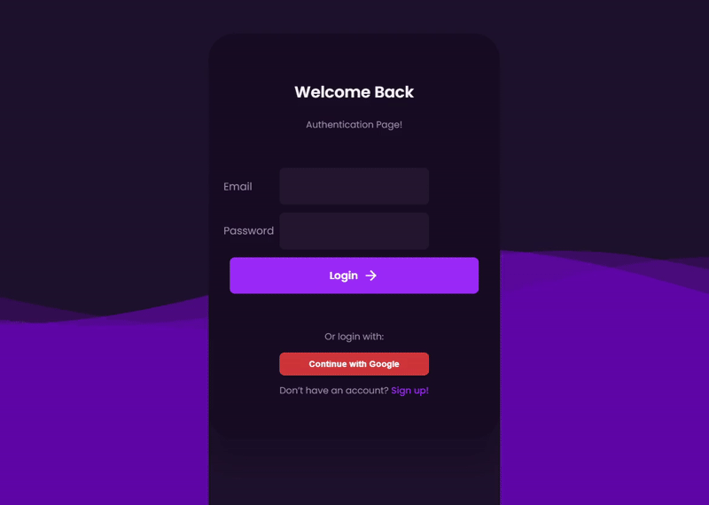

<h1 align="center">Authentication Page using Spring Boot & React</h1>


## 🚀 About The Project

A sleek and secure authentication system featuring local login/signup and Google OAuth2, built with Spring Boot on the backend and React for the frontend.

- 🔐 Secure user registration and login
- 🌍 OAuth2 Google authentication
- 🎨 Modern UI with responsive design
- ⚡ Lightning fast development with Spring Boot and React

---

## 🎥 Interface



## 📂 Folder Structure
```
Authentication-Page-using-Springboot-and-React/
│
├── Auth2Project/               # Spring Boot App
│   ├── src/
│   ├── pom.xml
│
├── React-frontend/        # React Frontend App
│   ├── public/
│   ├── src/
│   ├── package.json
│       
└── README.md
```


## 🛠️ Tech Stack

| Layer              | Technology                                                                                                  |
|--------------------|-------------------------------------------------------------------------------------------------------------|
| **Backend**        | Java 21, Spring Boot                                                                       |
| **Frontend**       | React, JavaScript (ES6+), HTML5, CSS3           |
| **Build Tools**    | Maven                                                                           |
| **Authentication** | OAuth2 (Google) , Spring Security                                                                                           |
| **Database**       | PostgreSQL      |                                                                         |
| **Version Control** | GitHub                              |
---


## 🚀 Steps to Run the Application

### 1. Clone the repository

```bash
git clone https://github.com/j4ik2i5x0/Authentication-Page-using-Springboot-and-React.git
cd Authentication-Page-using-Springboot-and-React
```

---

### 2. Set up PostgreSQL

* Create a database (e.g., `auth_db`)
* Update your DB credentials in:

```
/src/main/resources/application.properties
```

Example:

```properties
spring.datasource.url=jdbc:postgresql://localhost:5432/auth_db
spring.datasource.username=your_db_username
spring.datasource.password=your_db_password
```

---

### 3. Configure Google OAuth2

* Go to [Google Cloud Console](https://console.cloud.google.com/)
* Create OAuth2 credentials
* Add the **Client ID** and **Client Secret** to:

```
src/main/resources/application.properties
```

Example:

```properties
spring.security.oauth2.client.registration.google.client-id=YOUR_GOOGLE_CLIENT_ID
spring.security.oauth2.client.registration.google.client-secret=YOUR_GOOGLE_CLIENT_SECRET
```

* Add your redirect URI (e.g. `http://localhost:8080/login/oauth2/code/google`) to the **Authorized redirect URIs** in Google Cloud Console.

---

### 4. Run the Backend

```bash
cd backend
mvn clean install
mvn spring-boot:run
```

Runs on: `http://localhost:8080`

---

### 5. Run the Frontend

```bash
cd ../React-frontend
npm install
npm start
```

Runs on: `http://localhost:3000`

---
Great! Here's a clean and modern **Contributing** and **License** section for your `README.md`, ready to copy-paste:

---

## 🤝 Contributing

Contributions are welcome! Feel free to:

* Fork the repository
* Create a new branch (`git checkout -b feature/your-feature`)
* Commit your changes (`git commit -m 'Add new feature'`)
* Push to the branch (`git push origin feature/your-feature`)
* Open a Pull Request

Please follow conventional code styling and ensure the app runs locally before submitting a PR.

---

## 📝 License

This project is licensed under the [MIT License](LICENSE).

> You are free to use, modify, and distribute this project with proper attribution. See the LICENSE file for details.

---

